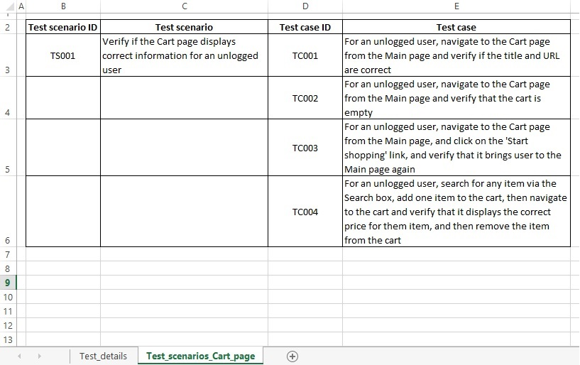

# eBayProject
An implementation of a test scenario covering the testing of the eBay page, using Page Object Pattern. Testing performed in Chrome browser. Code implemented in Eclipse using Java, Selenium WebDriver and TestNG.

### Prerequisites
To run the project, you will need:

* JDK 8 - you can download [here](https://www.oracle.com/technetwork/java/javase/downloads/jdk8-downloads-2133151.html).
* Eclipse - you can download [here](https://www.eclipse.org/downloads/packages/).
* Maven - you can download 'Maven integration for Eclipse' from Eclipse Marketplace.
* TestNG - you can download 'TestNG for Eclipse' plug-in from Eclipse Marketplace.
* Chrome Driver - version used: Chrome 75. Driver is already added to the project in the src/test/resources/drivers folder.

Maven uses the below dependencies:
* Selenium WebDriver - used version 3.141.59.
* TestNG - used version 6.14.3.

### Running the test
In order to perfom the testing, run testng.xml file.

Address of a website being tested:
https://www.ebay.com/

For now, the test convers basic test cases for the Cart page content and Search page content.

Screenshot of eBay page:

Sample screenshot of the Excel file:

Developed page/component objects:
* Header Component - the header of the eBay page
* Footer Component - the footer (version for subpages such as Cart Page)
* Cart Page - eBay subpage that displays your cart
* Item Listed Component - small boxes displaying individual items on Search page

Partly developed page/component objects that need finishing:
* Main Page - main eBay page
* Search Page - search page on eBay
* Item Page - subpage displaying an individual item to buy
* Item In Cart Component - an item box on the Cart page
* Left Bar Component - a left bar displaying different search criteria on the Search page

Ideas for future development:
* finishing off the current classes
* tests that involve a logged in user

### Acknowledgments
Any problems that I stumbled upon while working on the project were solved thanks to:
* [Selenium documentation](https://seleniumhq.github.io/selenium/docs/api/java/)
* _Selenium Testing Tools Cookbook_, Second Edition, Unmesh Gundecha
* Online tutorials - e.g. www.toolsqa.com, www.guru99.com, https://www.seleniumeasy.com/
* Stack Overflow
* Youtube videos
